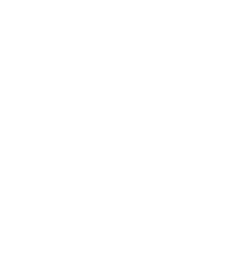

<!-- PROJECT LOGO -->
 

<h3 align="center">Scientific Computing with Python</h3>

    freeCodeCamp Course
     
    <a href="https://www.freecodecamp.org/learn/scientific-computing-with-python/><strong>Explore the course »</strong></a>
     
     
    <a href="#">View Certification</a>
  

[![The Certification][the-certification]](#)

<!-- ABOUT THE PROJECT -->

## About The Project

This repository contains my learning journey while completing the **Scientific Computing with Python Certification** from freeCodeCamp.

Through this course, I explored foundational concepts in Python programming, including:

- Variables and data types
- String and number manipulation
- Control structures (loops, conditionals)
- Functions
- Algorithms and problem solving

<!-- ROADMAP -->

## Roadmap

- [X] Learn String Manipulation by Building a Cipher
- [ ] Learn How to Work with Numbers and Strings by Implementing the Luhn Algorithm
- [ ] Learn Lambda Functions by Building an Expense Tracker
- [ ] Learn Python List Comprehension by Building a Case Converter Program
- [ ] Learn the Bisection Method by Finding the Square Root of a Number
- [ ] Certification Project: Build an Arithmetic Formatter Project
- [ ] Learn Regular Expressions by Building a Password Generator
- [ ] Learn Algorithm Design by Building a Shortest Path Algorithm
- [ ] Learn Recursion by Solving the Tower of Hanoi Puzzle
- [ ] Learn Data Structures by Building the Merge Sort Algorithm
- [ ] Certification Project: Build a Time Calculator Project
- [ ] Learn Classes and Objects by Building a Sudoku Solver
- [ ] Learn Tree Traversal by Building a Binary Search Tree
- [ ] Certification Project: Build a Budget App Project
- [ ] Learn Special Methods by Building a Vector Space
- [ ] Learn Interfaces by Building an Equation Solver
- [ ] Certification Project: Build a Polygon Area Calculator Project
- [ ] Learn Encapsulation by Building a Projectile Trajectory Calculator
- [ ] Certification Project: Build a Probability Calculator Project

[the-certification]: images/certification.png
